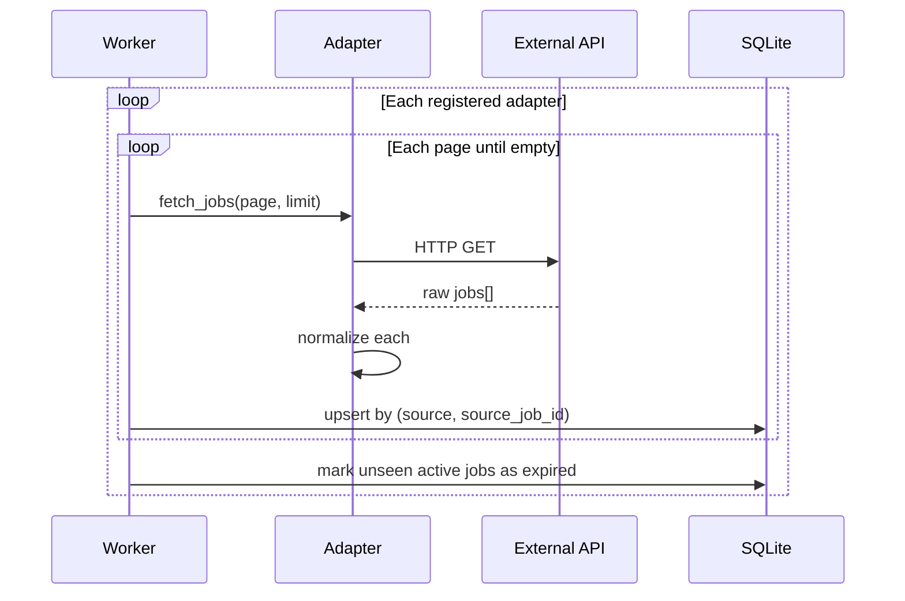

# Job Ingestion Architecture

This document describes how the Smart Job Portal POC gathers job listings from external job-board APIs, normalizes them into a single schema, stores them locally, and serves them to the React frontend.

**Current state (POC):** Two job sources:
- **MyCareersFuture** — public API, no key required
- **Adzuna** — official API (Singapore), requires free API key from [developer.adzuna.com](https://developer.adzuna.com)

---

## High-level flow

```
┌─────────────────────┐     ┌─────────────────────┐     ┌─────────────────────┐
│  Job source APIs    │     │  Python backend     │     │  React frontend     │
│  (external)         │     │                     │     │                     │
│                     │     │  ┌───────────────┐  │     │  Search / detail    │
│  MyCareersFuture ───┼────►│  │ Adapters      │  │     │  pages              │
│  (future sources)   │     │  │ fetch+normalize│  │     │                     │
│                     │     │  └───────┬───────┘  │     │         ▲           │
│                     │     │          ▼          │     │         │           │
│                     │     │  ┌───────────────┐  │     │  ┌──────┴───────┐  │
│                     │     │  │ Sync worker   │  │     │  │ jobs.ts API  │  │
│                     │     │  │ upsert+expire │  │     │  │ client       │  │
│                     │     │  └───────┬───────┘  │     │  └──────────────┘  │
│                     │     │          ▼          │     │                     │
│                     │     │  ┌───────────────┐  │     │  localStorage only  │
│                     │     │  │ SQLite DB     │◄─┼─────┤  for application    │
│                     │     │  │ (jobs table)  │  │     │  tracking (separate)│
│                     │     │  └───────┬───────┘  │     │                     │
│                     │     │          ▼          │     │                     │
│                     │     │  ┌───────────────┐  │     │                     │
│                     │     │  │ FastAPI       │──┼────►│  GET /api/v1/jobs   │
│                     │     │  │ search routes │  │     │  GET /api/v1/jobs/id│
│                     │     │  └───────────────┘  │     │                     │
└─────────────────────┘     └─────────────────────┘     └─────────────────────┘
```

**Important:** Job listings live in **SQLite** (backend). User application tracking lives in **browser localStorage** (frontend only). These are separate concerns.

**At runtime:** `GET /api/v1/jobs` reads **only** from SQLite — it never calls external job-board APIs. Fresh data requires running the sync worker (`uv run python -m app.worker --sync`).

---

## Core design principle

> No single source's API shape should leak into the rest of the system.

Every job source gets its own **adapter** that translates that source's response into one **canonical schema**. Search, storage, and the frontend only ever interact with the canonical shape.

Adding source #2 or #3 means: write one adapter class + register it in the sync worker. No changes to the `jobs` table structure, search API, or React UI (beyond optional source badges/filters).

---

## Components

| Component | Location | Role |
|-----------|----------|------|
| **Adapter interface** | `backend/app/adapters/base.py` | Contract: `fetch_jobs()` + `normalize()` |
| **Source adapters** | `backend/app/adapters/<source>/` | Per-API HTTP client and field mapping |
| **Sync worker** | `backend/app/worker/sync.py` | Loops adapters, upserts, expires stale jobs |
| **Canonical models** | `backend/app/models/schemas.py` | Pydantic `CanonicalJobInput` |
| **ORM / DB** | `backend/app/models/orm.py` | SQLAlchemy `Job` model → `jobs` table |
| **Upsert / expire** | `backend/app/db/upsert.py` | Write logic and staleness handling |
| **Search** | `backend/app/db/search.py` | Query active jobs with filters |
| **REST API** | `backend/app/api/routes/jobs.py` | Exposes jobs to frontend |
| **Frontend client** | `frontend/src/api/jobs.ts` | `fetchJobs`, `fetchJobById` |

---

## Step 1 — Fetch from source APIs (adapters)

Each adapter implements `JobSourceAdapter`:

```python
class JobSourceAdapter(ABC):
    source_name: str

    async def fetch_jobs(self, params: FetchParams) -> list[dict]:
        # Call external API, handle pagination, return raw JSON objects

    def normalize(self, raw: dict) -> CanonicalJobInput:
        # Map source-specific fields → canonical schema
```

### MyCareersFuture (live today)

| Item | Value |
|------|--------|
| File | `backend/app/adapters/mycareersfuture/adapter.py` |
| API | `https://api.mycareersfuture.gov.sg/v2/jobs` |
| Auth | None (public API) |
| Pagination | `page` + `limit` query params |
| Source ID | `raw["uuid"]` → `source_job_id` |
| Apply URL | `metadata.jobDetailsUrl` |

### Adzuna (second source)

| Item | Value |
|------|--------|
| File | `backend/app/adapters/adzuna/adapter.py` |
| API | `https://api.adzuna.com/v1/api/jobs/sg/search/{page}` |
| Auth | `ADZUNA_APP_ID` + `ADZUNA_APP_KEY` (env vars) |
| Pagination | Page number in URL path (1-based), `results_per_page` param |
| Source ID | `raw["id"]` → `source_job_id` |
| Apply URL | `redirect_url` |

The adapter is **only registered** when both env vars are set. Without keys, sync continues with MyCareersFuture only (no accidental expiry of Adzuna rows).

**Setup:**

1. Register at https://developer.adzuna.com
2. Add to `backend/.env`:
   ```env
   ADZUNA_APP_ID=your_app_id
   ADZUNA_APP_KEY=your_app_key
   ```
3. Run sync: `uv run python -m app.worker --sync --max-pages 2`

### Adding more sources

Register new adapter classes in `get_adapters()` in `backend/app/worker/sync.py`:

```python
def get_adapters() -> list[JobSourceAdapter]:
    adapters = [MyCareersFutureAdapter()]
    if AdzunaAdapter.is_configured():
        adapters.append(AdzunaAdapter())
    # adapters.append(JobStreetAdapter())  # future
    return adapters
```

Each adapter runs in its own `try/except` so one failing source does not block others.

---

## Step 2 — Normalize to canonical schema

Raw API responses differ per source. Adapters map them to `CanonicalJobInput`:

| Field | Purpose |
|-------|---------|
| `source` | Origin identifier, e.g. `mycareersfuture` |
| `source_job_id` | ID from origin system (upsert key with `source`) |
| `title`, `company_name`, `company_uen` | Display + search |
| `location` | `{ address, district, region, lat, lng }` |
| `salary_min`, `salary_max`, `salary_currency`, `salary_period` | Filter + display (null if unknown) |
| `employment_type`, `seniority_level`, `skills` | Metadata / filters |
| `description` | Detail page + search |
| `posted_date`, `expiry_date` | Sorting and freshness |
| `apply_url` | Click-through to apply on source site |
| `raw_payload` | Full original JSON (debugging, re-mapping) |

**Rule:** If a source does not provide a field, leave it `null`. Do not guess. `raw_payload` preserves the original for later improvements.

---

## Step 3 — Sync worker (ingestion pipeline)

**Entry point:**

```bash
cd backend
uv run python -m app.worker --init-db    # create tables (first time)
uv run python -m app.worker --sync       # full sync (all pages per source)
uv run python -m app.worker --sync --max-pages 2   # POC: limit pages per source
```

### `--max-pages` flag

`--max-pages N` caps how many **API pages** the worker fetches **per source** (MyCareersFuture, Adzuna, etc.) — not per job and not across all sources combined.

The worker loops `page = 0, 1, …` until `page >= max_pages` or the source returns no more results (`backend/app/worker/sync.py`).

| Source | Default page size (`config.py`) | `--max-pages 2` ≈ max jobs |
|--------|----------------------------------|----------------------------|
| MyCareersFuture | 100 (`mcf_page_size`) | ~200 |
| Adzuna | 50 (`adzuna_page_size`) | ~100 |

- **With `--max-pages 2`:** fast POC runs, fewer external API calls.
- **Without `--max-pages`:** full sync — keeps paging until each source is exhausted (can be tens of thousands of listings for MyCareersFuture).

After sync, reload the frontend; no API server restart is required.

### Scheduled sync (optional)

`backend/app/worker/scheduler.py` can run a daily cron sync (default 2:00 AM). It is **not** started by `uvicorn` — local dev uses manual `--sync` unless you run the scheduler separately.

**Logic** (`backend/app/worker/sync.py`):



### What happens to existing data on sync?

Sync does **not** wipe the database. It **merges** fetched jobs into whatever is already in SQLite.

Each job is keyed by **`(source, source_job_id)`** (see `backend/app/db/upsert.py`).

| Situation | What happens |
|-----------|----------------|
| Job already in DB and returned again | Row is **updated** (title, salary, description, etc.) and set to `status = active` |
| Job new from the API | **New row** inserted with `status = active` |
| Job was `active` but **not seen** in this sync run | Marked **`expired`** — row stays in DB but is hidden from search |

Search only returns `status = active` jobs (`backend/app/db/search.py`). Expired rows are a **soft delete**, not a physical removal.

**The DB is never cleared on sync** — same jobs are updated in place, new jobs are added, and missing jobs are expired.

#### Example: full sync (`--sync` with no page limit)

Suppose your DB already has 3 active MyCareersFuture jobs:

| source_job_id | title | status |
|---------------|-------|--------|
| `job-A` | Software Engineer | active |
| `job-B` | Data Analyst | active |
| `job-C` | Nurse | active |

You run a **full sync**. MyCareersFuture returns:

- `job-A` — still listed, salary updated
- `job-B` — still listed, unchanged
- `job-D` — new listing
- (`job-C` is no longer on MCF — not returned)

**After sync:**

| source_job_id | title | status | What happened |
|---------------|-------|--------|----------------|
| `job-A` | Software Engineer | active | **Updated** (e.g. new salary) |
| `job-B` | Data Analyst | active | **Unchanged** (re-upserted, still active) |
| `job-C` | Nurse | **expired** | Not in API response → soft-deleted from search |
| `job-D` | Product Manager | active | **Inserted** (new row) |

The UI search shows 3 jobs (`job-A`, `job-B`, `job-D`). `job-C` is still in SQLite but hidden.

#### Example: limited sync (`--max-pages 2`)

Same starting DB (200+ active jobs from an earlier full sync). You run:

```bash
uv run python -m app.worker --sync --max-pages 2
```

MyCareersFuture returns **only the first 2 pages** (~200 jobs). Those IDs go into `seen_ids`.

**After sync:**

- Those ~200 jobs → stay **active** (updated if changed)
- **All other** previously active MCF jobs (e.g. jobs on page 3+) → marked **`expired`**, even though they still exist on MyCareersFuture

So the UI might drop from 5,000 listings to ~200 — not because MCF removed them, but because the limited sync treated “not fetched” as “stale.”

That is why `--max-pages 2` is for **quick testing**, not for keeping a large accurate catalog.

### `--max-pages` and expiry (important)

`expire_stale_jobs` runs **after every sync** and marks any **active** job from that source that was **not** in the current run’s `seen_ids` as `expired`.

With a **full sync** (no `--max-pages`), `seen_ids` contains every job the source returned across all pages — expiry correctly reflects jobs that are gone from the source.

With **`--max-pages 2`**, only the first 2 pages per source are fetched, so `seen_ids` is a **subset**. All other previously active jobs from that source can be marked `expired` even though they still exist on MyCareersFuture — they simply were not in those 2 pages.

| Sync mode | Expiry behavior |
|-----------|-----------------|
| Full `--sync` | Expire only jobs the source no longer returns |
| `--max-pages 2` | Fast for testing, but can **hide** older listings that weren’t in the limited fetch |

Use `--max-pages 2` for quick local runs; use full `--sync` when you want accurate expiry and a complete dataset.

### Staleness

Data is a **cache** refreshed on each sync run, not live on every user search.

| Mechanism | Behavior |
|-----------|----------|
| Scheduled / manual sync | Re-fetches and updates listings |
| Upsert | Overwrites changed title, salary, description, etc. |
| `expire_stale_jobs` | Jobs no longer returned by a source are marked `expired` |
| Search filter | Only `status = active` jobs are returned to frontend |
| `expiry_date` | Stored from source; can be used for additional filtering later |

**Tradeoff:** Listings may be hours old between syncs. This is intentional — aggregators sync on a schedule (e.g. daily) rather than calling every external API on every search.

---

## Step 4 — Storage (SQLite)

| Item | Value |
|------|--------|
| Default URL | `sqlite:///./jobportal.db` (see `backend/.env`) |
| Table | `jobs` |
| Future option | Postgres via `docker-compose.yml` + `DATABASE_URL` |

The frontend **never** reads SQLite directly. It only talks to FastAPI.

---

## Step 5 — Search API (backend → frontend contract)

**Base URL:** `http://localhost:8000` in dev (Vite proxies `/api` from the frontend; see `frontend/vite.config.ts`)

**Reads from SQLite only** — `search_jobs()` in `backend/app/db/search.py` queries the `jobs` table. No outbound HTTP to job sources on this path.

| Endpoint | Purpose |
|----------|---------|
| `GET /api/v1/jobs` | Search and filter with pagination |
| `GET /api/v1/jobs/{id}` | Single job detail |
| `GET /health` | Health check |

### Query parameters (`GET /api/v1/jobs`)

| Param | Description |
|-------|-------------|
| `q` | Keyword search (title, description, company) |
| `salary_min`, `salary_max` | Salary range overlap |
| `location` | District, region, or address (partial match) |
| `source` | Filter by source, e.g. `mycareersfuture` |
| `page`, `limit` | Pagination (default limit 20) |
| `sort` | `posted_date_desc` (default) or `salary_desc` |

Implementation: `backend/app/db/search.py` → `backend/app/api/routes/jobs.py`

---

## Step 6 — Frontend consumption

The React app does **not** call MyCareersFuture or any job-board API directly for listings.

| File | Responsibility |
|------|----------------|
| `frontend/src/api/jobs.ts` | HTTP client to FastAPI |
| `frontend/src/pages/HomePage.tsx` | Search, filters, job cards |
| `frontend/src/pages/JobDetailPage.tsx` | Full job view, apply button |
| `frontend/src/components/ApplyButton/` | Opens `apply_url` in new tab |

**Apply flow:** User clicks Apply → source website opens in new tab → user signs in and applies **on that site**. The portal does not submit applications.

### Application tracking (separate from job ingestion)

| Storage | What | Where |
|---------|------|--------|
| SQLite | Job listings from APIs | Backend |
| localStorage | User's tracked applications (status, notes) | Browser only |

Tracking is documented separately; it does not affect how jobs are gathered or stored.

---

## Adding a new job source (checklist)

1. **Research API** — auth, pagination, rate limits, available fields, legal/ToS.
2. **Create adapter** — `backend/app/adapters/<source>/adapter.py` implementing `fetch_jobs` + `normalize`.
3. **Map to canonical schema** — populate `apply_url`; leave unknown fields null.
4. **Register** — add instance to `ADAPTERS` in `backend/app/worker/sync.py`.
5. **Run sync** — `uv run python -m app.worker --sync`.
6. **Verify** — search API returns jobs with correct `source` badge; apply link works.
7. **Dedup (when 2+ sources)** — compare cross-posted listings; show "also posted on X" (future).

No frontend changes required beyond existing `SourceBadge` and optional `source` filter.

---

## File reference

```
backend/
├── app/
│   ├── adapters/
│   │   ├── base.py                    # Adapter interface
│   │   ├── mycareersfuture/
│   │   │   └── adapter.py             # MCF fetch + normalize
│   │   └── adzuna/
│   │       └── adapter.py             # Adzuna fetch + normalize
│   ├── worker/
│   │   ├── sync.py                    # Ingestion loop
│   │   └── __main__.py                # CLI: --init-db, --sync
│   ├── db/
│   │   ├── upsert.py                  # Upsert + expire
│   │   └── search.py                  # Search queries
│   ├── models/
│   │   ├── schemas.py                 # Canonical + API models
│   │   └── orm.py                     # jobs table
│   └── api/routes/jobs.py             # REST endpoints

frontend/
└── src/
    ├── api/jobs.ts                    # Consumes backend API
    └── pages/
        ├── HomePage.tsx               # Search results
        └── JobDetailPage.tsx          # Job detail + apply
```

---

## Future improvements (not in POC)

| Area | Direction |
|------|-----------|
| Database | Postgres via `docker-compose.yml` for production scale |
| Sync schedule | APScheduler cron (`backend/app/worker/scheduler.py`) |
| Freshness UI | Show "Last synced at …" on search page |
| Hybrid refresh | Re-fetch single job from source on detail view |
| User tracking | Move from localStorage to Postgres + auth |
| Cross-source dedup | `job_duplicates` table + "Also posted on" UI |
