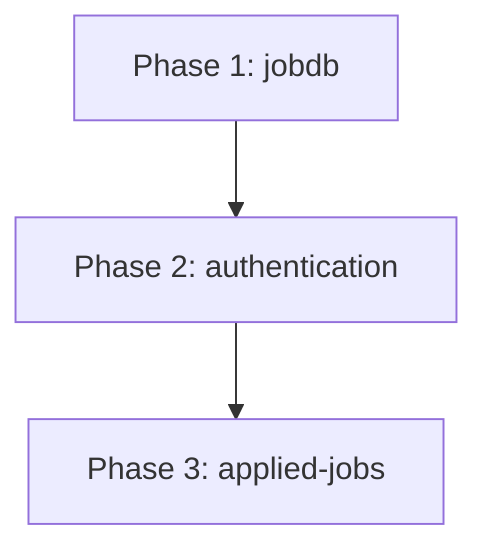

# Database Setup Plan

Step-by-step plan to move from SQLite-only local POC toward a deployable setup with **PostgreSQL in Docker**, optional **SQLite fallback**, **portal authentication**, and **database-backed application tracking**.

## Scope

| In scope | Out of scope (later) |
|----------|----------------------|
| Postgres via Docker on local machine / VPS | Full dockerization of FastAPI + React |
| Dual backend via `DATABASE_URL` (SQLite or Postgres) | Managed cloud DB provisioning |
| Alembic migrations | Multi-region replication |
| User auth (JWT) | OAuth / social login |
| Applied jobs in DB (per user) | Email notifications |

## Architecture summary

Full rationale and diagrams: [00-overview.md](./00-overview.md).

```
External APIs  →  worker (--sync)  →  jobs table  →  FastAPI  →  React
                     ↑                      ↑
              DATABASE_URL            users + applications (Phase 2–3)
              sqlite or postgres
```

## Execution order

Phases must run in sequence. Each phase leaves the app buildable.



| Phase | Directory | Summary | Depends on |
|-------|-----------|---------|------------|
| 1 | [jobdb/](./jobdb/) | Docker Postgres, Alembic, verify SQLite + Postgres | — |
| 2 | [authentication/](./authentication/) | Users table, JWT API, frontend login | Phase 1 |
| 3 | [applied-jobs/](./applied-jobs/) | Applications API, migrate off `localStorage` | Phases 1–2 |

## Progress

### Phase 1 — jobdb

| Step | Document | Status | Finished |
|------|----------|--------|----------|
| 1.1 | [jobdb/01-docker-compose.md](./jobdb/01-docker-compose.md) | ⬜ Not started | — |
| 1.2 | [jobdb/02-alembic-migrations.md](./jobdb/02-alembic-migrations.md) | ⬜ Not started | — |
| 1.3 | [jobdb/03-dual-backend-verify.md](./jobdb/03-dual-backend-verify.md) | ⬜ Not started | — |
| 1.4 | [jobdb/04-production-hardening.md](./jobdb/04-production-hardening.md) | ⬜ Not started | — |

### Phase 2 — authentication

| Step | Document | Status | Finished |
|------|----------|--------|----------|
| 2.1 | [authentication/01-user-model.md](./authentication/01-user-model.md) | ⬜ Not started | — |
| 2.2 | [authentication/02-auth-api.md](./authentication/02-auth-api.md) | ⬜ Not started | — |
| 2.3 | [authentication/03-frontend-auth.md](./authentication/03-frontend-auth.md) | ⬜ Not started | — |
| 2.4 | [authentication/04-security-checklist.md](./authentication/04-security-checklist.md) | ⬜ Not started | — |

### Phase 3 — applied-jobs

| Step | Document | Status | Finished |
|------|----------|--------|----------|
| 3.1 | [applied-jobs/01-schema-and-api.md](./applied-jobs/01-schema-and-api.md) | ⬜ Not started | — |
| 3.2 | [applied-jobs/02-frontend-migration.md](./applied-jobs/02-frontend-migration.md) | ⬜ Not started | — |
| 3.3 | [applied-jobs/03-localstorage-import.md](./applied-jobs/03-localstorage-import.md) | ⬜ Not started | — |

## Locked decisions

| # | Question | Decision |
|---|----------|----------|
| 1 | Production database | **PostgreSQL 16 Alpine** (`postgres:16-alpine`) |
| 2 | How backend picks DB | **`DATABASE_URL` env var** — no separate runtime toggle |
| 3 | Local dev default | **SQLite** (`sqlite:///./jobportal.db`) |
| 4 | Schema management | **Alembic** (replace ad-hoc `create_all` for deploy paths) |
| 5 | Auth mechanism | **JWT Bearer tokens** (POC); cookies considered for hardening |
| 6 | Job search access | **Public** — auth required only for dashboard / tracking |

## Success criteria (all phases)

- [ ] Worker `--sync` writes to whichever DB `DATABASE_URL` points at
- [ ] API `GET /api/v1/jobs` reads from the same DB as the worker
- [ ] Alembic `upgrade head` works on SQLite and Postgres
- [ ] Users can register, log in, and access protected routes
- [ ] Tracked applications persist per user in the database
- [ ] `npm run build` and backend tests pass after each phase

## Related docs

- [Product README](../../README.md)
- [Job ingestion architecture](../../docs/job-ingestion-architecture.md)
- [Frontend UI redesign plan](../frontend-ui-redesign/README.md)
