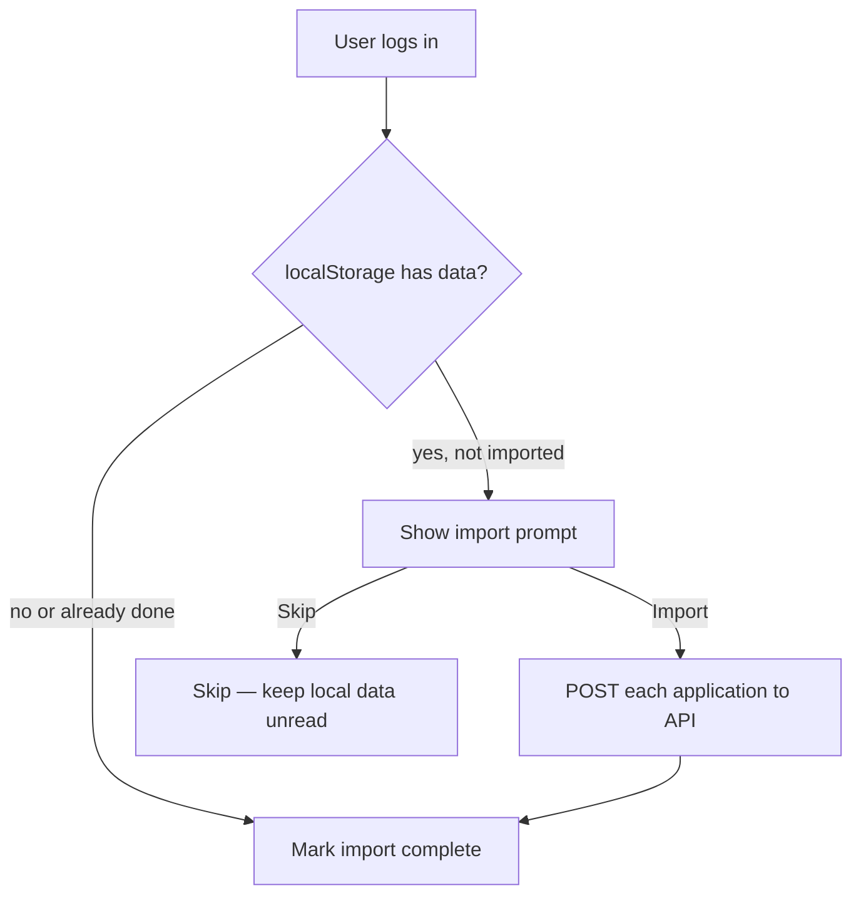

# Step 3.3 — localStorage Import (one-time migration)

**Goal:** Offer users a one-time import of existing browser-tracked applications into their account after login, without data loss during the Phase 3 transition.

**Status:** ⬜ Not started  
**Depends on:** [02-frontend-migration.md](./02-frontend-migration.md)  
**Blocks:** —

**Estimated effort:** 1 session

---

## Context

Users who tracked jobs before Phase 3 have data in:

```
localStorage key: jobPortal_trackedApplications
```

Format: JSON array of `TrackedApplication` objects (see `frontend/src/types/job.ts`).

After Phase 3, new tracking goes to the API. This step migrates legacy data once per browser.

---

## Import strategy



---

## Tasks

### 3.3.1 Import completion flag

**localStorage key:** `jobPortal_importedToDb` = `"true"` after successful import

Prevents re-importing on every login. Do not delete original data until import succeeds (optional: delete after success).

### 3.3.2 Import utility

**New file:** `frontend/src/utils/importLocalApplications.ts`

```typescript
const STORAGE_KEY = 'jobPortal_trackedApplications';
const IMPORTED_KEY = 'jobPortal_importedToDb';

export function hasLocalApplications(): boolean;
export function hasImported(): boolean;
export async function importLocalApplications(): Promise<ImportResult>;
```

**`importLocalApplications` logic:**

1. Read and parse `jobPortal_trackedApplications`
2. For each item:
   - `POST /applications` with `{ job_id: item.jobId, status: item.status, notes: item.notes }`
   - On `409 Conflict` (duplicate): skip, count as skipped
   - On `404` (job not in DB): optionally POST with snapshot-only fallback — **requires backend support** or skip with warning
3. Return `{ imported: number, skipped: number, failed: number, errors: [] }`
4. Set `jobPortal_importedToDb = true`
5. Optionally clear `jobPortal_trackedApplications`

### 3.3.3 Import UI

**Option A — Modal on dashboard first visit after login:**

**New component:** `frontend/src/components/ImportApplicationsModal/ImportApplicationsModal.tsx`

Copy:

> We found **N** tracked applications saved in this browser. Import them to your account?

Buttons: **Import now** | **Not now**

Show progress during import; summary on completion.

**Option B — Banner on dashboard:**

Less intrusive; same actions.

Show only when:

- `isAuthenticated`
- `hasLocalApplications() && !hasImported()`

### 3.3.4 Edge cases

| Case | Handling |
|------|----------|
| `jobId` no longer in backend DB | Skip with message, or store snapshot-only if API supports `job_id: null` + snapshot in body |
| Duplicate already in DB | Skip (`409`) |
| Partial failure | Show which failed; do not set `imported` flag until user retries or confirms |
| User clicks "Not now" | Do not set flag; prompt again next visit (or add "Don't ask again") |
| Multiple browsers | Each browser imports its own local data once |
| User not logged in | No import; local data untouched |

### 3.3.5 Backend consideration (optional enhancement)

If many jobs were tracked against IDs that no longer exist:

Extend `POST /applications` to accept optional `job_snapshot` in body for import-only use, with `job_id` nullable. Document as admin/import path or allow when `job_id` lookup fails.

Otherwise: import only records where `job_id` still exists in `jobs` table.

### 3.3.6 README update

Document that pre-Phase-3 `localStorage` data can be imported once after upgrading.

---

## Verification checklist

- [ ] User with existing `localStorage` data sees import prompt after login
- [ ] Import creates correct rows in `applications` table
- [ ] Duplicates skipped without error spam
- [ ] `jobPortal_importedToDb` prevents re-prompt
- [ ] "Not now" dismisses without data loss
- [ ] Fresh user (no local data) never sees prompt
- [ ] Import works on both SQLite and Postgres backends

---

## Manual test procedure

1. Before Phase 3 deploy: track 2–3 jobs in browser (localStorage populated)
2. Deploy Phase 3; register/login
3. Confirm import modal appears with correct count
4. Import → verify dashboard shows all jobs
5. Check DB: `applications` rows have correct `user_id` and `job_snapshot`
6. Reload → no second prompt
7. Clear `jobPortal_importedToDb` in devtools → prompt returns (dev only)

---

## Files touched (implementation)

| File | Change |
|------|--------|
| `frontend/src/utils/importLocalApplications.ts` | New |
| `frontend/src/components/ImportApplicationsModal/` | New |
| `frontend/src/pages/DashboardPage.tsx` | Show modal/banner |
| `README.md` | Import note |
