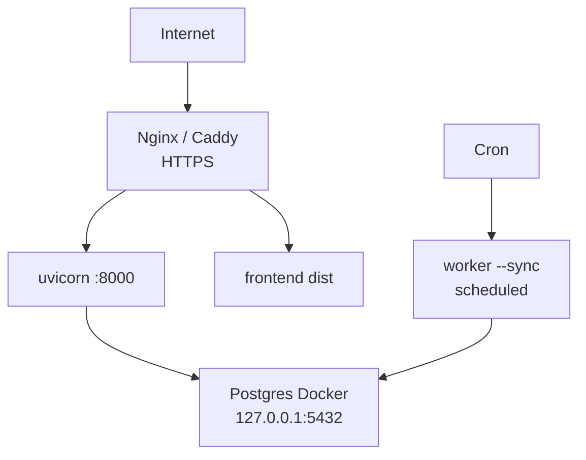

# Step 1.4 — Production Hardening (Database)

**Goal:** Prepare the Postgres Docker setup for deployment on a real server (your PC as server, VPS, or homelab) without changing application logic.

**Status:** ⬜ Not started  
**Depends on:** [01-docker-compose.md](./01-docker-compose.md), [03-dual-backend-verify.md](./03-dual-backend-verify.md)  
**Blocks:** — (can overlap with Phase 2 security checklist)

**Estimated effort:** 1 session

---

## Scope

This step covers **database infrastructure** only. Application auth hardening is in [authentication/04-security-checklist.md](../authentication/04-security-checklist.md).

---

## Tasks

### 1.4.1 Strong credentials

**Never use `jobportal`/`jobportal` on a public server.**

Generate a strong password:

```bash
openssl rand -base64 32
```

Set in root `.env` (Docker):

```env
POSTGRES_PASSWORD=<generated>
```

Update `backend/.env`:

```env
DATABASE_URL=postgresql+psycopg2://jobportal:<generated>@localhost:5432/jobportal
```

Add `backend/.env` to `.gitignore` if not already ignored.

### 1.4.2 Network binding

**Same host (API + Postgres on one machine):**

Bind Postgres to localhost only so it is not exposed to the LAN/internet:

```yaml
ports:
  - "127.0.0.1:5432:5432"
```

**Future: API in Docker, Postgres in Docker:**

Use Docker Compose internal network — do not publish port `5432` to the host at all. API service connects via hostname `postgres`.

### 1.4.3 Firewall

On a VPS:

- Allow inbound: `80`, `443` (reverse proxy to API/frontend)
- Block inbound: `5432` from public internet
- SSH: key-only, non-default port optional

### 1.4.4 Backups

**Manual backup:**

```bash
docker exec <postgres_container> pg_dump -U jobportal jobportal > backup_$(date +%Y%m%d).sql
```

**Restore:**

```bash
cat backup.sql | docker exec -i <postgres_container> psql -U jobportal -d jobportal
```

**Automated (cron example):**

```cron
0 3 * * * docker exec jobportal-postgres pg_dump -U jobportal jobportal | gzip > /backups/jobportal_$(date +\%Y\%m\%d).sql.gz
```

Document retention policy (e.g. keep 7 daily, 4 weekly).

### 1.4.5 Volume durability

- Named volume `postgres_data` survives container recreation
- Document: `docker compose down -v` **destroys all data**
- For VPS: consider bind mount to a host path under `/var/lib/jobportal/postgres` for easier backup tooling

### 1.4.6 Connection pooling (optional)

For higher load, add PgBouncer or SQLAlchemy pool tuning in `session.py`:

```python
create_engine(url, pool_pre_ping=True, pool_size=5, max_overflow=10)
```

Not required for POC; note for future scale.

### 1.4.7 Managed Postgres migration path

When moving off self-hosted Docker:

1. Provision managed Postgres (Supabase, Railway, RDS, etc.)
2. Set `DATABASE_URL` to provider connection string
3. Run `alembic upgrade head` against new DB
4. `pg_dump` / `pg_restore` or re-run worker `--sync` for jobs data

No application code change if URL format stays `postgresql+psycopg2://...`.

### 1.4.8 Monitoring basics

- `docker compose ps` — container health
- Postgres logs: `docker compose logs -f postgres`
- Disk space on volume mount
- Optional: enable `log_min_duration_statement` for slow queries in dev

---

## Server deployment sketch



Components on one VPS:

| Service | How to run |
|---------|------------|
| Postgres | `docker compose up -d` |
| API | `uvicorn` via systemd or process manager |
| Worker | cron or systemd timer (`SYNC_CRON_SCHEDULE`) |
| Frontend | `npm run build` → serve static via Nginx |
| TLS | Let's Encrypt via Caddy or certbot |

Full app containerization is a **future** optional step.

---

## Verification checklist

- [ ] Postgres not reachable from public IP on port 5432
- [ ] Strong password set and documented securely (password manager, not git)
- [ ] Backup script tested: dump → restore → `alembic current` matches
- [ ] `docker compose down` + `up -d` preserves data
- [ ] README or `docs/operations/deployment.md` references this hardening guide

---

## Pre-go-live checklist

- [ ] Change all default passwords
- [ ] Confirm `.env` files not in git
- [ ] Backup schedule in place
- [ ] Know how to restore from backup
- [ ] HTTPS enabled for API and frontend
